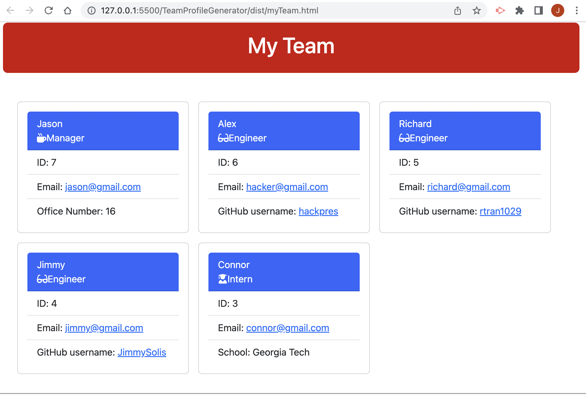
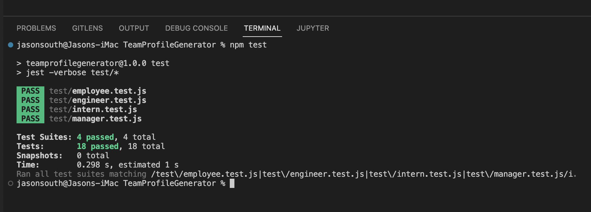

# Team Profile Generator

## Demo Video

<a href="https://drive.google.com/file/d/18zcwagYfWxA40EGAJbYvk6SWNo92GZXQ/view" title="TeamProfileGenerator_demo">Link to Demo Video</a>

## Table of Content
- [Description](#description)
- [Installation](#installation)
- [Usage Information](#usage)
- [Test Instructions](#test)
- [License](#license)
- [Contributor](#contributor)
- [Contact Information](#contact)

## Description

This CLI application was designed to run in Node.js for a Manager to have the ability to quickly generate a HTML webpage that displays his team members basic contact information and have access to their emails and GitHub profiles.  User only has to answer the prompted questions, which then generates the information in card format.  Jest was used for testing purposes.

## Installation

npm i

## Usage

This application is to be invoked from CLI by enter node.index.js

## Test

npm test

## License

[MIT](https://choosealicense.com/licenses/mit/) license

## Contributor

Jason South is the primary contributor

## Contact
Jason South  
GitHub username: jsouth75  
Email: jason.south@me.com

